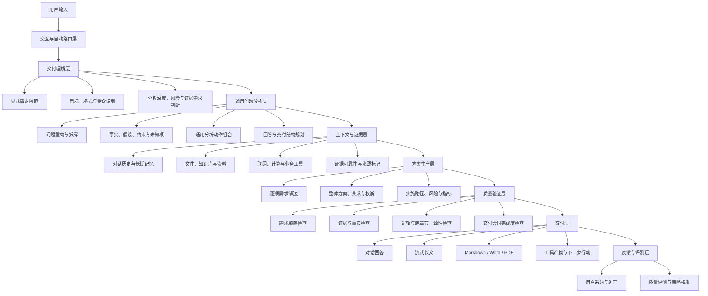

# Second-Person 通用问题解决系统优化方案

> 本文是历史设计基线。当前实现已采用事件化 Agent 运行时和宿主控制的提示词组装，具体行为以生产代码及专项契约文档为准。

## 1. 产品定位

Second-Person 是一个通用问题解决系统。它的职责不是根据问题是否命中某个预置领域来决定回答质量，而是稳定完成以下工作：

1. 完整识别用户明确提出的需求与交付要求。
2. 理解用户真正希望达成的目标、约束和上下文。
3. 将复杂问题拆解为可验证、可执行的部分。
4. 按需使用对话历史、记忆、文件、知识库和工具作为证据。
5. 为每项明确需求给出对应解法，并形成统一方案。
6. 对最终结果进行完整性、正确性和一致性校验。
7. 以回答、长文报告、Markdown、Word、PDF 或工具产物交付结果。

产品的核心价值是：无论用户提出的是产品方案、工程问题、复杂决策、研究分析还是长篇文档任务，系统都能以完整解决问题为第一目标。

## 2. 设计原则

### 2.1 显式需求完整覆盖

用户明确提出的每一项需求必须被识别、记录和回应。问题重构、优先级和排期只能补充与组织需求，不能替代、遗漏或回避用户已经提出的事项。

最终回答必须能建立以下映射：

```text
用户需求 -> 对应解法 -> 实现机制 -> 依赖条件 -> 风险边界 -> 验收方式
```

### 2.2 质量优先

性能优化的对象是重复计算、串行等待、无效调用和上下文重复，不是用户需要的内容长度、分析深度或需求覆盖范围。

当用户需要完整方案、长篇报告或正式文档时，系统应按完整性要求交付。单次生成无法承载的长内容，应通过统一总纲、分章节生成、跨章节校验和文档组装完成，而不是缩短内容。

### 2.3 通用能力优先

系统不以 CRM、教育、财务、法务等领域名称作为回答能力边界。领域信息属于当前问题的上下文；通用能力才是产品内核。

通用能力包括：需求提取、目标识别、问题拆解、因果分析、比较权衡、证据组织、方案设计、风险识别、计划编排、质量校验和结果表达。

### 2.4 事实、假设和结论分离

所有复杂回答应区分：

- 事实：用户明确提供或由证据支持的信息。
- 假设：为继续分析而暂时采用、但尚未确认的前提。
- 未知项：会显著影响结论但目前缺失的信息。
- 推断：基于事实和逻辑得到的判断。
- 建议：在当前条件下可执行的行动方案。

### 2.5 不静默降级

工具、检索或模型出现异常时，系统不得在用户未知的情况下将完整任务缩减成简略回答。应继续交付当前证据下可成立的完整部分，并明确待验证内容；需要长文档时，应切换为分段或文档化交付。

## 3. 总体架构



## 4. 用户交互与自动模式

### 4.1 默认模式

默认模式为 `AI 自动`。系统根据任务结构、风险、证据需求和交付要求选择执行路径。用户仍可手动选择快速或深度模式作为覆盖，但该选择不影响显式需求覆盖。

### 4.2 两种执行模式与三种深度交付形态

用户可见和可选择的执行模式只有两种，`AI 自动` 是默认路由控制：

| 控制或模式 | 适用任务 | 系统行为 |
| --- | --- | --- |
| `AI 自动` | 默认 | 模型基于任务结构自主选择 `快速回答` 或 `深度思考`，并推送可解释的路由结论。 |
| 快速回答 | 单一、明确、低风险的问题 | 直接回答，保持简洁，但完整回应用户明确需求。 |
| 深度思考 | 多需求、方案设计、复杂决策、归因分析、长篇交付 | 建立问题模型、逐项给出解法、执行质量门；根据交付合同使用直接、结构化或长文分节交付。 |

`直接回答`、`结构化深度回答`、`长文与文档交付`是深度模式内部的交付形态，不能作为新增用户模式。

### 4.3 前端展示

前端应展示简洁、可读的处理摘要，不展示原始推理过程。例如：

```text
已识别 6 项明确需求，正在形成整体方案。
已整合历史材料与文件依据。
正在校验方案之间的依赖关系与实施顺序。
```

对于长任务，前端展示目录、已完成章节、资料状态和文档生成状态。用户看到的是可验证的工作进度，而不是空泛的“正在思考”。

## 5. 通用问题解决流程

```text
用户输入
-> 交付合同
-> 显式需求清单
-> 问题模型
-> 分析动作组合
-> 上下文与证据
-> 逐项解决方案
-> 整体方案整合
-> 质量验证
-> 最终交付
```

### 5.1 交付合同

系统首先明确本轮需要交付什么，而不是预先限制回答篇幅。

```json
{
  "deliverable_type": "product_plan",
  "audience": "产品团队与管理层",
  "required_depth": "完整方案",
  "requested_length": "仅在用户明确指定时遵守",
  "required_format": ["功能设计", "架构", "排期", "指标"],
  "evidence_requirement": "按问题需要决定",
  "acceptance_criteria": [
    "所有明确需求均有解法",
    "方案有完整关系说明",
    "排期与依赖一致"
  ]
}
```

### 5.2 显式需求清单

每个明确需求生成一个 `RequirementItem`，作为最终回答的强制覆盖项。

```json
{
  "id": "R1",
  "raw_request": "用户原始需求",
  "expected_outcome": "用户期望结果",
  "solution_required": true,
  "solution": "对应解决方案",
  "dependencies": ["数据、能力或工具"],
  "acceptance_criteria": ["验收方式"],
  "status": "covered"
}
```

### 5.3 问题模型

问题模型是所有后续分析和生成的统一事实源。

```json
{
  "user_goal": "用户最终目标",
  "explicit_requirements": [],
  "facts": [],
  "assumptions": [],
  "constraints": [],
  "unknowns": [],
  "relationships": [],
  "reasoning_operations": [],
  "evidence_needs": [],
  "answer_contract": []
}
```

### 5.4 通用分析动作

系统根据问题结构组合以下动作，而非按领域套固定模板：

- 提取与归纳。
- 分组与依赖分析。
- 问题重构。
- 多层拆解。
- 因果分析。
- 方案比较与权衡。
- 约束与风险分析。
- 证据验证。
- 实施计划编排。
- 反例与矛盾检查。
- 结果综合与表达。

## 6. 上下文、证据与工具

### 6.1 证据优先级

系统按以下顺序使用信息：

1. 用户当前消息和明确提供的材料。
2. 当前会话上下文。
3. 用户已授权的长期记忆与知识库。
4. 文件解析结果。
5. 工具结果、计算结果和实时检索结果。
6. 模型基于一般知识的推断。

所有重要结论应尽量能回溯到对应事实、资料或明确标注的假设。

### 6.2 工具使用原则

工具调用由证据缺口决定，而不是由领域名称决定。例如：

- 需要实时事实时使用检索。
- 需要处理表格、文档或代码时使用对应解析和执行工具。
- 需要计算时调用计算工具。
- 需要正式交付物时调用文档生成工具。

无依赖的检索、文件解析和工具调用应并行执行；依赖前一步结果的任务保持顺序，避免错误并行。

## 7. 方案生产与长内容交付

### 7.1 逐项解法

每个 `RequirementItem` 对应一个 `SolutionUnit`：

```json
{
  "requirement_id": "R1",
  "solution": "解决方案",
  "mechanism": "如何工作",
  "inputs": ["输入数据"],
  "outputs": ["输出结果"],
  "dependencies": ["依赖条件"],
  "risks": ["风险边界"],
  "validation": ["验证指标"],
  "evidence": ["支撑依据"]
}
```

### 7.2 整体方案整合

逐项解法完成后，系统必须进一步说明：

- 各项能力如何共享数据、上下文和结果。
- 哪些能力互为前提，哪些可以独立推进。
- 是否形成业务或执行闭环。
- 实施顺序为何如此安排。
- 哪些风险需要提前解决。

### 7.3 长文与文档生产

长内容采用以下流程：

```text
完整交付合同
-> 全局总纲与目录
-> 章节需求映射
-> 证据整理
-> 分章节生成
-> 统一术语、数据和结论
-> 跨章节一致性校验
-> 完整文档交付
```

全局总纲是唯一事实源。独立章节可以并行生产，但必须共享总纲、术语、事实、核心结论和交付要求。最终进行全局整合，避免章节之间出现数据、排期、概念或结论矛盾。

单次模型调用的物理输出限制只限制单个章节，不限制整篇交付：未收到章节完成标记时，系统以已保存的章节内容为上下文继续该章节；完成章节立即落库。重连、进程恢复或用户再次进入同一任务时从已完成章节继续。系统不得因总篇幅把长文缩减为摘要。

## 8. 质量验证体系

### 8.1 需求覆盖质量门

在最终输出前验证：

- 每一项显式需求是否已生成对应解法。
- 每个解法是否说明实现机制、依赖和验收方式。
- 后置事项是否已经给出完整方案及后置理由。
- 是否存在因问题重构而遗漏原始需求的情况。

### 8.2 内容质量门

验证：

- 是否准确理解用户目标。
- 是否区分事实、假设、未知项和建议。
- 是否有无依据的确定性结论。
- 是否给出方案之间的权衡。
- 是否包含可执行的下一步。
- 是否存在逻辑跳跃、重复或矛盾。

### 8.3 长内容一致性门

验证：

- 章节是否覆盖全部交付要求。
- 术语和数据模型是否统一。
- 排期是否与依赖关系一致。
- 结论是否与前文证据一致。
- 是否存在跨章节冲突、重复或遗漏。

质量门以交付合同为依据，不以内容是否足够短为依据。

## 9. 性能与可靠性设计

### 9.1 性能优化原则

优化重复工作，不优化掉用户需要的内容：

- 将需求提取、问题建模、分析动作选择和回答结构规划合并为一次结构化分析。
- 将无依赖的记忆检索、文件解析、知识库检索和工具调用并行执行。
- 缓存已解析的文件、已确认的术语、已检索的资料和已完成的工具结果。
- 对长文采用总纲和章节化生产，减少上下文重复并提高一致性。
- 对复杂校验优先进行规则检查，仅在发现关键问题时执行额外模型审校。

### 9.2 可靠性策略

- 工具失败时，交付不依赖该工具的完整部分，并标注待验证项。
- 检索失败时，降低事实结论强度，不伪造来源。
- 单次输出无法承载长内容时，切换为分章节和文档化交付。
- 模型不可用时，明确告知任务状态，不伪装完成。
- 系统不得静默减少用户要求的内容范围或交付标准。
- 不展示或持久化模型原生链式思维；仅展示模式结论、问题建模、资料状态、章节进度与质量门结果等可验证摘要。

### 9.3 性能指标

性能与质量独立评估：

- 首个有效结果出现时间。
- 完整交付完成时间。
- 长文与文档生成完成时间。
- 工具与检索耗时。
- 并行执行比例。
- 超时率、失败率、降级率。
- 用户中断率。
- 完整交付率。

## 10. 现有项目落地映射

### 10.1 前端

[`frontend/src/views/ChatView.vue`](../frontend/src/views/ChatView.vue)

- 默认思考模式改为 `auto`，显示为“自动模式”。
- 保留快速和深度作为用户覆盖选项。
- 展示模式决策、需求识别、资料状态、章节完成度和文档状态。
- 不展示原始链式思维。

### 10.2 快速预判

[`agent/intent_parser.py`](../agent/intent_parser.py)

`QuickIntentResult` 负责：

- 自动路由建议。
- 初步复杂度和风险判断。
- 是否需要上下文、证据或工具。
- 是否需要结构化或长文交付。

它不决定最终内容长度，也不作为领域路由器。

### 10.3 收敛与问题模型

[`agent/intent_parser.py`](../agent/intent_parser.py) 与 [`agent/meta_cognitive.py`](../agent/meta_cognitive.py)

将现有丰满意图和认知骨架升级为统一的问题模型，至少包含：

- 显式需求。
- 用户目标。
- 事实、假设、约束和未知项。
- 需求之间的关系。
- 所需分析动作。
- 证据需求。
- 回答与交付结构。

### 10.4 编排主链路

[`agent/core.py`](../agent/core.py)

主链路调整为：

```text
快速路由
-> 交付合同与需求提取
-> 问题模型
-> 上下文、检索与工具
-> 逐项方案生产
-> 整体方案整合
-> 质量验证
-> 最终交付
```

收敛后的丰满意图、焦点和问题模型必须传递给后续策略、证据和回答生成环节，避免后续模块只基于用户原句重复判断。

### 10.5 策略与回答生成

[`agent/strategy_engine.py`](../agent/strategy_engine.py) 负责选择通用分析动作、证据需求和交付形式。

[`agent/response_synthesizer.py`](../agent/response_synthesizer.py) 根据交付合同生成普通回答、结构化方案、长篇报告或正式文档，而非仅依据 `brief / normal / detailed` 控制篇幅。

## 11. 评测与反馈闭环

### 11.1 黄金评测集

建立覆盖以下场景的评测集：

- 多需求产品方案。
- 复杂决策。
- 工程设计与故障诊断。
- 文件和资料分析。
- 长篇报告与正式文档。
- 用户纠正、补充和上下文承接。

每个案例至少标注：

- 显式需求清单。
- 必须识别的目标、约束或假设。
- 可接受的分析动作。
- 不应出现的失实结论。
- 最低交付结构。

### 11.2 核心指标

| 指标 | 说明 |
| --- | --- |
| 显式需求覆盖率 | 用户明确需求中被完整回应的比例。 |
| 核心目标命中率 | 回答是否理解用户真正目标。 |
| 假设标注准确率 | 推测是否被正确标记为假设。 |
| 证据可追溯率 | 重要结论是否能回溯到资料或事实。 |
| 方案可执行性 | 是否有明确机制、依赖、行动和验收标准。 |
| 跨章节一致性 | 长文档是否存在冲突、重复或遗漏。 |
| 用户纠正率 | 用户因漏答或误解而要求修正的比例。 |
| 完整交付率 | 任务是否按交付合同完成。 |

## 12. 实施阶段

### P0：自动模式与需求覆盖

- 前端默认使用 `AI 自动`。
- 明确自动、快速覆盖和深度覆盖语义。
- 新增显式需求提取和覆盖状态。
- 建立需求覆盖埋点与基础测试。

### P1：统一问题模型

- 扩展收敛环与认知骨架。
- 建立交付合同、问题模型和方案单元。
- 合并重复策略判断，减少无效模型调用。
- 让后续模块消费完整理解结果。

### P2：证据型分析与长文交付

- 基于证据缺口调用记忆、知识库、文件和工具。
- 支持并行资料处理和工具执行。
- 支持总纲、章节生产、跨章节校验和文档导出。

### P3：质量门与反馈学习

- 建立需求覆盖、证据、逻辑和一致性质量门。
- 建立黄金评测集和回归测试。
- 接入用户采纳、纠正和中断反馈。
- 基于真实质量数据持续校准路由和生成策略。

## 13. 最终能力链路

```text
用户需求
-> 完整识别
-> 目标与约束理解
-> 问题拆解
-> 证据组织
-> 逐项解法
-> 整体方案
-> 质量验证
-> 完整交付
```

该链路不依赖领域命中，不以缩短内容换取速度，并以用户任务的完整完成作为所有优化的首要标准。
